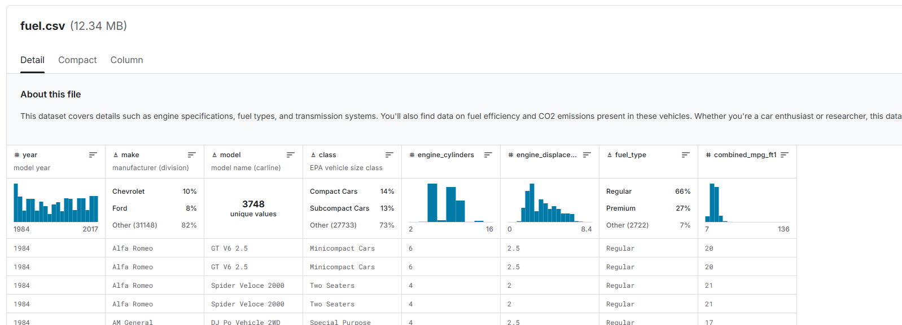

# Fahrzeugverbrauchs-Prognose  
End-to-End Machine Learning Projekt 

## Projektziel

Ziel dieses Projekts war es, ein Machine-Learning-Modell zu entwickeln und als interaktive Gradio-App bereitzustellen, das den durchschnittlichen Kraftstoffverbrauch eines Fahrzeugs (in Litern pro 100 km) vorhersagt.  
Dabei wurde ein vollständiger End-to-End-Prozess umgesetzt: von der Datenbeschaffung über Feature Engineering, Modellvergleich bis hin zum Deployment.

---

## Datenquellen

Datensatz 1: https://www.kaggle.com/datasets/ahmettyilmazz/fuel-consumption

In diesem Datensatz benötige ich nur folgende Spalten/Attribute um das ganze nicht unnötig zu verkomplizieren. 
Daher werden die anderen Werte, die nicht benötigt werden, aus dem csv herausgefiltert

Datensatz 2: https://www.kaggle.com/datasets/sahirmaharajj/fuel-economy

Hier benötige ich eigentlich nur diese Datensätze. Daher musste ich die anderen herausfiltern. 
Ausserdem ist bei diesem Datensatz der Verbrauch nicht pro 100km angegeben sondern in miles per Galon. 
Diesen Wert habe ich auf l/100km zusammengeführt.

---

## Feature Engineering

-   Als nächstes habe ich die Datensätze zusammengeführt. Dazu habe ich die Tabellenspalten identisch benannt und in die selbe Reihenfolge gesetzt.
    So konnte ich die Daten ohne Probleme zusammenführen. 

-   Die Werte welche eins zu eins doppelt vorhanden sind, wurden aus dem Datensatz gefiltert. Damit wird Rauschen (Noise) verhindert.
    Sonst könnte das Modell nicht nachvollziehen, warum zwei gleiche Inputs zwei verschiedene Outputs liefern. Das erschwert das Lernen, senkt die Modellgüte, erzeugt Overfitting-Risiko.

-   Nun sind noch sehr viele unterschiedliche Klassen vorhanden. Diese möchte ich ein wenig generalisieren damit das Modell etwas übersichtlicher wird.
    Daher habe ich die vorhandenen Klassen ind diese 8 Klassen unterteilt. Weitere nicht zugewiesene Klassen werden der Klasse "Other" zugewiesen.

    | Neue Klasse            | Enthält                                                                                  |
    | ---------------------- | ------------------------------------------------------------------------------------------------------------------------ |
    | **Car - Small**        | COMPACT, SUBCOMPACT, MINICOMPACT, Minicompact, Subcompact Cars, Compact Cars, Small Station Wagons                       |
    | **Car - Midsize**      | MID-SIZE, Midsize Cars, Midsize Station Wagons, Station wagon: Small, Station wagon: Mid-size                            |
    | **Car - Large**        | FULL-SIZE, Large Cars, Full-size, Midsize-Large Station Wagons                                                           |
    | **SUV**                | SUV, SUV - SMALL, SUV - STANDARD, SUV: Small, SUV: Standard, Small Sport Utility Vehicle, Standard Sport Utility Vehicle |
    | **Pickup Truck**       | PICKUP TRUCK - SMALL/STANDARD, Small/Standard Pickup Trucks (2WD/4WD), Pickup truck: Small/Standard                      |
    | **Van/Minivan**        | VAN, VAN - CARGO, VAN - PASSENGER, Minivan, Vans, Minivan - 2WD/4WD, Vans Passenger, Vans, Passenger Type                |
    | **Special**            | Two-seater, Two Seaters, SPECIAL PURPOSE VEHICLE, Special Purpose Vehicle, etc.                                          |

-   Im ursprünglichen Datensatz enthielt die Spalte fuel_type eine Vielzahl an Kraftstoffarten, darunter auch alternative Antriebsarten wie Elektro, Ethanol oder Gas-Hybride. 
    Da der Fokus dieses Projekts auf der klassischen Verbrauchsberechnung in Liter pro 100 km liegt, wurden alle nicht direkt vergleichbaren Antriebssysteme (z. B. Elektro, Hybride, CNG, Ethanol usw.) aus dem Datensatz entfernt. 
    Nur reine Verbrennungsfahrzeuge wurden beibehalten und in drei generalisierte Kategorien überführt:

    | Neue Klasse            | Enthält                                                                                  |
    | ---------------------- | ------------------------------------------------------------------------------------------------------------------------ |
    | **gasoline regular**   | Regular gasoline, Regular, Midgrade, COMPACT,                                                                            |
    | **gasoline premium**   | Premium gasoline, Premium                                                                                                |
    | **diesel**             | diesel                                                                                                                   |
    | **entfernt**           | Ethanol (E85), Natural Gas, CNG, Electricity, Gasoline or natural gas, Gasoline or E85, Gasoline or propane, Premium or  |
    |                        | E85, Premium Gas or Electricity, Regular Gas and Electricity, Premium and Electricity, Regular Gas or Electricity        |

-   Die Marke und Modelle im Datensatz 1 nur mit Grossbuchstaben aufgeführt und im Datensatz 2 mit Gross- und Kleinschreibung.
    Damit diese Datensätze im gleichen Format sind und keine doppelten Datensätze durchrutschen, wird alles in Grossbuchstaben gespeichert und danach die Duplikate aussortiert.

-   Beim Zusammenführen der beiden Datensätze zeigte sich, dass einige Fahrzeuge mehrfach vorhanden waren – also identische Einträge hinsichtlich Hersteller, Modell , Baujahr, Zylinderanzahl, Motorgröße, Fahrzeugklasse und Kraftstofftyp. Der einzige Unterschied zwischen diesen Einträgen lag im Verbrauchswert.
    Diese mehrfach vorkommenden Fahrzeugkonfigurationen mit unterschiedlichen Verbrauchswerten sind in der Praxis auf Teststreuung, unterschiedliche Prüfzyklen oder externe Bedingungen zurückzuführen. Da diese Variationen im Datensatz nicht erklärbar sind (weil keine weiteren Einflussfaktoren wie z. B. Ausstattung, Fahrstil oder Gewicht erfasst wurden), würde ihr Erhalt im Modell zu Rauschen führen und die Trainingsqualität verschlechtern.
    Um diesem Problem zu begegnen, wurden alle Datensätze mit identischer Fahrzeugkonfiguration zu einem Eintrag zusammengefasst, indem der arithmetische Mittelwert des Verbrauchs gebildet wurde. Damit entsteht pro Fahrzeugausprägung genau ein durchschnittlicher, repräsentativer Verbrauchswert.

-   One-Hot-Encoding für kategorische Merkmale (`brand`, `vehicle_class`, `fuel_type`)

**Zielvariable:** `consumption_l_per_100km`

---

## Train Model

Zwei Modelle wurden trainiert und bewertet:

Der **Random Forest Regressor** zeigte die beste Leistung und wurde daher für die App übernommen.

| It. Nr | Modell           | R² Train | R² Test | RMSE Train | RMSE Test | Features                                                       | Kommentar                                                  |
|--------|------------------|----------|---------|------------|-----------|----------------------------------------------------------------|------------------------------------------------------------|
| 0      | LinearRegression | 0.590    | 0.596   | 1.959      | 1.973     | engine_size_l, cylinders                                       | Basislinie – zu einfach, hohe Fehlerwerte                  |
| 1      | RandomForest     | 0.704    | 0.699   | 1.665      | 1.702     | engine_size_l, cylinders                                       | Stärker als linear, gute erste nichtlineare Prognose       |
| 2      | RandomForest     | 0.826    | 0.801   | 1.278      | 1.383     | engine_size_l, cylinders, year                                 | Jahr als Feature bringt klare Verbesserung                 |
| 3      | RandomForest     | 0.852    | 0.826   | 1.177      | 1.294     | engine_size_l, cylinders, year, fuel_type                      | Kraftstofftyp verbessert Generalisierung weiter            |
| 4      | RandomForest     | 0.916    | 0.875   | 0.890      | 1.099     | engine_size_l, cylinders, year, fuel_type, vehicle_class       | sehr sinnvoll – Klassen sind deutlich relevant     |
| 5      | RandomForest     | 0.952    | 0.902   | 0.672      | 0.970     | engine_size_l, cylinders, year, fuel_type, vehicle_class, brand| brand bringt starke Verbesserung, aber Gefahr von Overfit  |

## Feauture Importance

---

## Modell & Deployment

Leider überschreitet das best_model.pkl die Dateigrösse von 100MB, weshab ich es das ganze Projekt nochmals hier abgelegt habe: https://drive.switch.ch/index.php/apps/files/?dir=/AI%20Project&fileid=8630154561 

Github: https://github.com/caccaluc/AI_Project
Huggingface App: https://huggingface.co/spaces/caccaluc/AI_Project
Higgingface files: https://huggingface.co/spaces/caccaluc/AI_Project/tree/main

---

